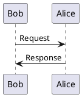
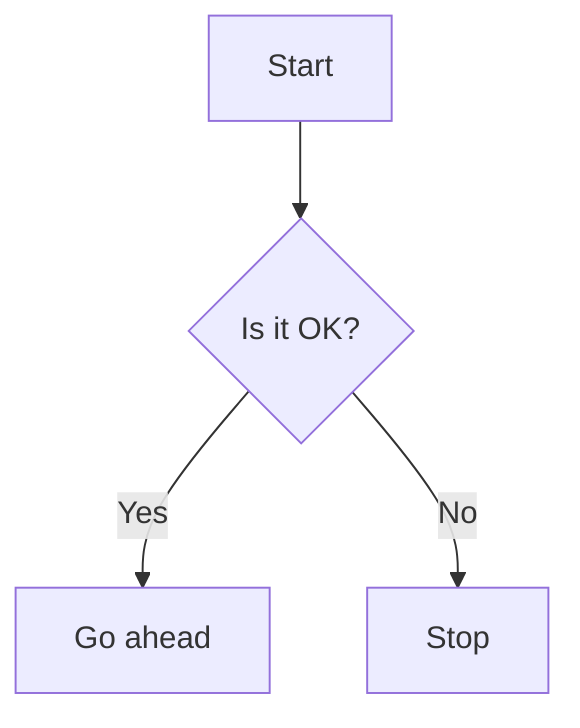

<!-- title:Sample document -->
<!-- style:/opt/turnup/default.css -->
<!-- config:embed-stylesheet -->
<!-- config:header-numbering 2 4 -->
<!-- config:entity-numbering-depth 1 -->

<!-- filter:gnuplot  = /opt/turnup/filters.sh gnuplot   %in %out     -->
<!-- filter:kaavio   = /opt/turnup/filters.sh kaavio    %in %out     -->
<!-- filter:plantuml = /opt/turnup/filters.sh plantuml  %in %out     -->
<!-- filter:mermaid  = /opt/turnup/filters.sh mermaid   %in %out     -->
<!-- filter:c        = /opt/turnup/highlight.sh         %in %out c   -->
<!-- filter:c++      = /opt/turnup/highlight.sh         %in %out cpp -->

<!-- <!-- config:term-link-in-header -->
<!-- <!-- config:write-comment -->

<!-- define: B = '@((font-weight:bold;)(%1))' -->
<!-- define: DLR = '$' -->
<!-- define: TODO = '@((background:red;color:white;)(ToDo : %1))' -->
<!-- define: MEMO = '@((background:blue;color:white;)(MEMO : %1))' -->
<!-- define: COLOR = '@((color:%1;)(%2))' -->
<!-- define: BGCLR = '@((background:%1;)(%2))' -->
<!-- define: BLANK_PARAGRAPH = '　　' -->
<!-- define: BLANK_LINE = '　　' -->


# Sample document

<!-- anchor: toc-link-target -->
```raw
<h2>Table of contents</h2>
```

<!-- embed:toc-x 2 4 -->
<!-- toc-link: top 'A#toc-link-target' -->

--------------------------------------------------------------------------------

## Header1
### Header2
#### Header3
##### Header4

　これは本文です。

### コードの埋め込み

```c
#include <stdio.h>

/*
 * this is block comment.
 */
int main( int argc, char* argv[] ) {
    // line comment.
    printf( "Hello world.\n" );    // partial comment.
    return 0;
}
```
Figure. コード埋め込みのサンプル


### PlantUML の埋め込み


Figure. PlantUML のサンプル


### Mermaid の埋め込み

Figure. Mermaid のサンプル


### kaavio の埋め込み
```kaavio
(diagram (300 150)
  (grid)
  (rect   '( 50  50) 80 60 :fill :powderblue :id :x)
  (circle '(250 100) 40    :fill :moccasin   :id :y)
  (connect :x :y :end2 :arrow))
```
Figure. kaavio のサンプル

### gnuplot の埋め込み

```gnuplot
set datafile separator ","
set terminal svg size 500,300 fixed
set output out_file
plot in_file using 1:2 with lines notitle, in_file using 1:3 with lines notitle
------------------------------------------------------------------------
0,0,0
1,32,1
2,64,4
3,96,9
4,128,16
5,160,25
6,192,36
7,224,49
8,256,64
9,288,81
10,320,100
11,352,121
12,384,144
13,416,169
14,448,196
15,480,225
16,512,256
17,544,289
18,576,324
19,608,361
20,640,400
21,672,441
22,704,484
23,736,529
24,768,576
25,800,625
26,832,676
27,864,729
28,896,784
29,928,841
30,960,900
31,992,961
32,1024,1024
33,1056,1089
34,1088,1156
35,1120,1225
36,1152,1296
37,1184,1369
38,1216,1444
39,1248,1521
40,1280,1600
```
Figure. gnuplot のサンプル

### 添付ファイル

```attach
/opt/turnup/default.css
/opt/turnup/filters.sh
```


## 索引
<!-- embed:index-x -->

--------------------------------------------------------------------------------
<!-- embed:footnotes -->

